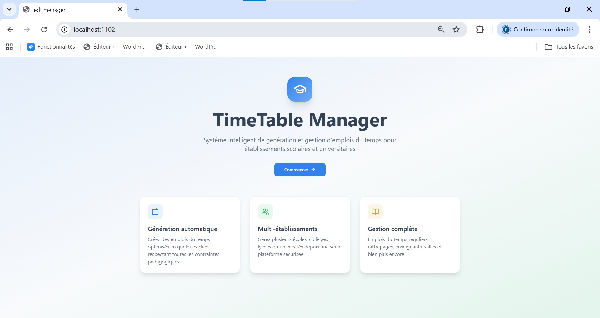
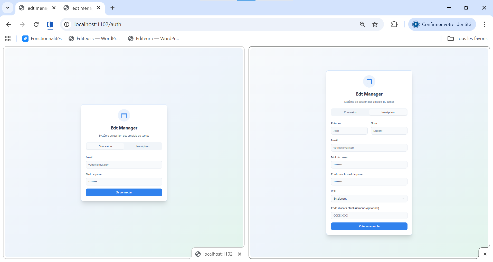
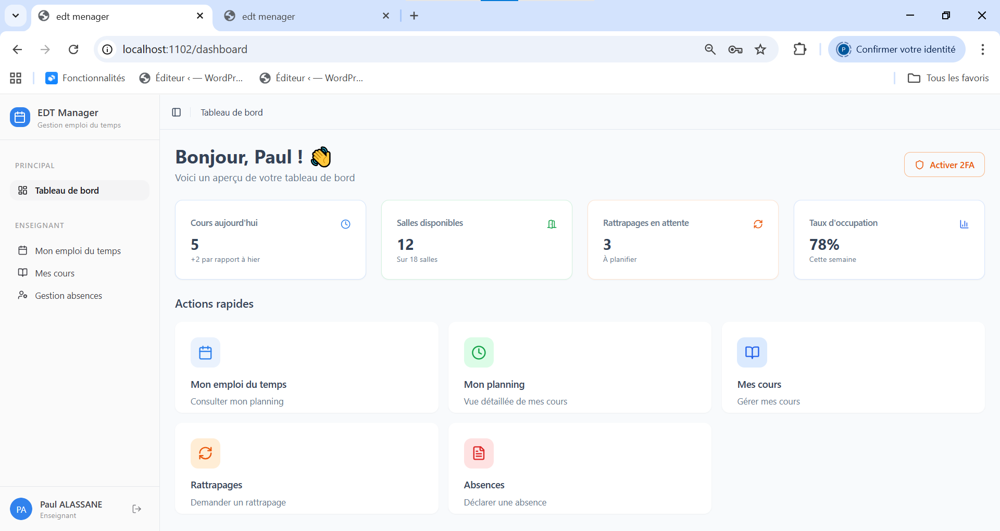

<!-- # MINISTÈRE DE L'ÉDUCATION NATIONALE

# RÉPUBLIQUE TOGOLAISE

# Travail-Liberté-Patrie

--- -->

# RAPPORT TECHNIQUE DE PROJET

# EN VUE DE LA PRÉSENTATION DU

# SYSTÈME DE GESTION D'EMPLOI DU TEMPS

---

## THÈME :

**Application Web de Génération et Gestion d'Emplois du Temps pour Établissements Scolaires et Universitaires**

---

**FORMATION :** DÉVELOPPEMENT WEB & WEB MOBILE

**Présenté et soutenu par :**
M. ALASSANE Paul

**Superviseur :**
M. TOGBA Lazare

**ANNÉE ACADÉMIQUE 2025-2026**

---

# REMERCIEMENTS

Je tiens à exprimer toute ma gratitude à mon superviseur et formateur, M. TOGBA Lazare, pour son soutien précieux et ses conseils éclairés tout au long de ce projet. Son accompagnement a été une source d'inspiration et de réussite.

Je souhaite également remercier chaleureusement l'équipe pédagogique de l'Académie Digitale Numérique (ADN) dont l'initiative a permis à de nombreux jeunes de bénéficier d'un cadre d'apprentissage exceptionnel.

Je n'oublie pas mes collègues développeurs pour leurs remarques constructives qui ont contribué à l'amélioration de ce travail.

Enfin, un grand merci à ma famille pour leur soutien indéfectible tout au long de mon parcours.

---

# RÉSUMÉ

Dans le cadre de la réalisation d'un projet pratique portant sur le développement d'une application de gestion d'emplois du temps, ce rapport présente la conception et l'implémentation d'un système complet destiné aux établissements scolaires et universitaires.

Ce projet, basé sur l'utilisation de technologies modernes orientées vers JavaScript et TypeScript, a été développé avec des outils adaptés à la création d'applications web performantes : React pour le frontend et Node.js/Express pour le backend.

L'objectif principal est de créer une plateforme permettant aux administrateurs, directeurs, responsables pédagogiques, enseignants et étudiants de gérer efficacement leurs emplois du temps, tout en offrant des fonctionnalités avancées telles que la génération automatique des plannings et l'authentification sécurisée avec support 2FA.

# SUMMARY

This report presents the design and implementation of a complete timetable management system for schools and universities. The project uses modern JavaScript/TypeScript technologies including React for the frontend and Node.js/Express for the backend.

The main objective is to create a platform enabling administrators, directors, pedagogical managers, teachers, and students to efficiently manage their schedules while offering advanced features such as automatic schedule generation and secure authentication with 2FA support.

---

# GLOSSAIRE

| Termes | Définition |
|--------|------------|
| API | Application Programming Interface, une interface permettant à deux applications de communiquer |
| JWT | JSON Web Token, standard ouvert pour l'échange sécurisé de jetons entre plusieurs parties |
| 2FA | Authentification à deux facteurs, méthode de sécurité exigeant deux formes d'identification |
| ORM | Object-Relational Mapping, technique de programmation pour convertir les données entre systèmes incompatibles |
| REST | Representational State Transfer, style d'architecture pour les systèmes distribués |
| SPA | Single Page Application, application web chargeant une seule page HTML |
| CORS | Cross-Origin Resource Sharing, mécanisme permettant les requêtes cross-origin |
| React | Bibliothèque JavaScript pour construire des interfaces utilisateur |
| TypeScript | Langage de programmation typé basé sur JavaScript |
| Vite | Outil de build rapide pour les projets web modernes |
| TailwindCSS | Framework CSS utilitaire pour le design |
| MySQL | Système de gestion de base de données relationnelle |
| Sequelize | ORM pour Node.js supportant MySQL, PostgreSQL, SQLite, etc. |
| Express | Framework web minimaliste pour Node.js |
| Axios | Client HTTP basé sur les promesses |
| React Query | Bibliothèque de gestion d'état serveur pour React |
| Shadcn/UI | Collection de composants UI réutilisables |

---

# Technologies JavaScript/TypeScript Utilisées

**Frontend :**
- **React** - Bibliothèque JavaScript pour construire des interfaces utilisateur interactives
- **TypeScript** - Langage de programmation avec typage statique
- **Vite** - Outil de build et serveur de développement ultra-rapide
- **TailwindCSS** - Framework CSS utilitaire pour le design responsive
- **React Router** - Système de routage pour les applications React
- **TanStack Query** - Gestion d'état serveur et cache intelligent
- **Axios** - Client HTTP pour les appels API
- **React Hook Form** - Gestion performante des formulaires
- **Zod** - Validation de schémas TypeScript-first
- **Lucide React** - Bibliothèque d'icônes modernes

**Backend :**
- **Node.js** - Environnement d'exécution JavaScript côté serveur
- **Express** - Framework web minimaliste et flexible
- **MySQL** - Base de données relationnelle
- **Sequelize** - ORM pour la manipulation des données
- **jsonwebtoken** - Création et vérification de JWT
- **bcrypt** - Hachage sécurisé des mots de passe
- **speakeasy** - Génération de codes 2FA

---

# LISTE DES TABLEAUX

| Tableau | Page |
|---------|------|
| Tableau 1 : Technologies Frontend | 10 |
| Tableau 2 : Technologies Backend | 10 |
| Tableau 3 : Endpoints API Authentification | 15 |
| Tableau 4 : Endpoints API Cours | 16 |
| Tableau 5 : Endpoints API Emploi du Temps | 16 |
| Tableau 6 : Hiérarchie des Rôles | 17 |
| Tableau 7 : Matrice des Permissions | 18 |

# LISTE DES FIGURES

| Figure | Page |
|--------|------|
| Figure 1 : Architecture globale du système | 8 |
| Figure 2 : Diagramme de classes - Gestion | Annexe |
| Figure 3 : Diagramme de classes - Générateur EDT | Annexe |
| Figure 4 : Diagramme de classes - Valeurs Objets | Annexe |
| Figure 5 : Diagramme de classes - Énumérations | Annexe |
| Figure 6 : Interface - Page d'accueil | 20 |
| Figure 7 : Interface - Page de connexion | 21 |
| Figure 8 : Interface - Tableau de bord | 22 |
| Figure 9 : Flux d'authentification 2FA | 17 |

---

# SOMMAIRE

## A. Cahier des charges
- I. Contexte et définition du projet
- II. Objectifs
- III. Périmètre
- IV. Description fonctionnelle
- V. Contraintes techniques

## B. Analyse et Conception
- I. Méthode d'analyse UML
- II. Architecture du système
- III. Modélisation des données
- IV. Diagrammes de classes

## C. Implémentation
- I. Structure du projet
- II. Technologies utilisées
- III. API Backend
- IV. Authentification et Sécurité
- V. Rôles et Permissions
- VI. Présentation des interfaces

## D. Bilan et Perspectives

---

# INTRODUCTION

Dans un contexte éducatif où la gestion du temps et des ressources devient de plus en plus complexe, les établissements scolaires et universitaires font face à des défis majeurs pour organiser efficacement leurs emplois du temps. La multiplicité des contraintes (disponibilité des enseignants, capacité des salles, cohérence pédagogique) rend cette tâche particulièrement ardue lorsqu'elle est effectuée manuellement.

Ce projet propose donc la création d'une application web complète dédiée à la gestion et la génération automatique des emplois du temps. Cette solution facilitera le travail des administrateurs et offrira à chaque acteur (directeurs, enseignants, étudiants) une vue personnalisée de son planning.

Grâce à une interface intuitive et moderne, les utilisateurs pourront naviguer facilement dans leurs emplois du temps, recevoir des notifications en temps réel, et bénéficier d'une authentification sécurisée avec support de l'authentification à deux facteurs (2FA).

En somme, notre plateforme vise à moderniser la gestion des emplois du temps, à réduire les erreurs de planification et à améliorer la communication au sein des établissements éducatifs.

---

# A. CAHIER DES CHARGES

## I. Contexte et définition du projet

Dans le secteur éducatif, la planification des emplois du temps constitue un défi organisationnel majeur. Les responsables pédagogiques doivent jongler avec de nombreuses contraintes : disponibilité des enseignants, capacité des salles, respect des volumes horaires, cohérence des parcours étudiants.

Ce projet vise à développer une application web moderne permettant :
- La gestion centralisée des emplois du temps multi-établissements
- La génération automatique de plannings optimisés
- Un accès personnalisé selon le rôle de l'utilisateur
- Une interface responsive accessible sur tous les appareils

## II. Objectifs

Le projet consiste à développer une plateforme qui :

- **Centralise** la gestion des emplois du temps pour plusieurs établissements
- **Automatise** la génération des plannings en respectant les contraintes
- **Personnalise** l'affichage selon le rôle (admin, directeur, enseignant, étudiant)
- **Sécurise** l'accès avec authentification JWT et support 2FA
- **Notifie** les utilisateurs des changements en temps réel
- **Exporte** les emplois du temps au format PDF

## III. Périmètre

Cette application est destinée à :
- **Administrateurs système** : gestion globale de la plateforme
- **Directeurs d'établissement** : supervision de leur établissement
- **Responsables pédagogiques** : gestion des plannings et ressources
- **Enseignants** : consultation de leur emploi du temps et déclaration d'absences
- **Étudiants** : consultation de leur emploi du temps et notifications

## IV. Description fonctionnelle

### Tableau des fonctionnalités

| Fonctionnalité | Description | Acteurs |
|----------------|-------------|---------|
| Authentification | Connexion sécurisée avec email/mot de passe et support 2FA | Tous |
| Gestion des utilisateurs | CRUD complet sur les utilisateurs et attribution des rôles | Admin, Directeur |
| Gestion des établissements | Configuration des établissements, classes, salles, matières | Admin, Directeur |
| Gestion des emplois du temps | Création, modification, suppression des séances | Admin, Directeur, Resp. Péda. |
| Consultation EDT | Affichage personnalisé de l'emploi du temps | Tous |
| Génération automatique | Algorithme de génération optimisée des plannings | Admin, Directeur |
| Gestion des salles | Disponibilité et réservation des salles | Admin, Directeur, Resp. Péda. |
| Notifications | Alertes en temps réel (changements, annulations, rattrapages) | Tous |
| Export PDF | Génération de documents PDF des emplois du temps | Tous |
| Déclaration d'absences | Signalement des absences par les enseignants | Enseignants |
| Gestion des rattrapages | Planification des cours de rattrapage | Admin, Directeur, Resp. Péda. |

## V. Contraintes techniques

- **Responsive Design** : Interface adaptée aux mobiles, tablettes et desktop
- **Performance** : Temps de chargement < 3 secondes
- **Sécurité** : Authentification JWT, chiffrement des mots de passe, protection CSRF
- **Compatibilité** : Navigateurs modernes (Chrome, Firefox, Safari, Edge)
- **Scalabilité** : Architecture permettant la montée en charge

---

# B. ANALYSE ET CONCEPTION

## I. Méthode d'analyse UML

L'analyse du système a été réalisée en utilisant le langage de modélisation UML (Unified Modeling Language), permettant une représentation visuelle claire des différents aspects de l'application.

### Outils utilisés
- **Lucidchart** : Création des diagrammes UML en ligne
- **PlantUML** : Génération de diagrammes à partir de code
- **Figma** : Conception des maquettes d'interface

## II. Architecture du système

### Architecture 3-tiers

``` ù
┌─────────────────────────────────────────────────────────────┐
│                   COUCHE PRÉSENTATION                        │
│                   (React + TypeScript)                       │
│                                                              │
│  ┌──────────┐  ┌──────────┐  ┌──────────┐  ┌──────────┐    │
│  │  Pages   │  │Components│  │  Hooks   │  │ Contexts │    │
│  └──────────┘  └──────────┘  └──────────┘  └──────────┘    │
└───────────────────────────┬──────────────────────────────────┘
                            │ HTTP/REST (Axios)
                            ▼
┌─────────────────────────────────────────────────────────────┐
│                    COUCHE MÉTIER                             │
│                (Node.js + Express)                           │
│                                                              │
│  ┌──────────┐  ┌──────────┐  ┌──────────┐  ┌──────────┐    │
│  │  Routes  │  │Controllers│ │ Services │  │Middleware│    │
│  └──────────┘  └──────────┘  └──────────┘  └──────────┘    │
└───────────────────────────┬──────────────────────────────────┘
                            │ Sequelize ORM
                            ▼
┌─────────────────────────────────────────────────────────────┐
│                   COUCHE DONNÉES                             │
│                    (MySQL)                                   │
│                                                              │
│  ┌──────────┐  ┌──────────┐  ┌──────────┐  ┌──────────┐    │
│  │Utilisateurs│ │  Cours  │  │  Salles  │  │   EDT    │    │
│  └──────────┘  └──────────┘  └──────────┘  └──────────┘    │
└─────────────────────────────────────────────────────────────┘
```

### Description des couches

| Couche | Rôle | Technologies |
|--------|------|--------------|
| Présentation | Interface utilisateur, interactions | React, TypeScript, TailwindCSS |
| Métier | Logique applicative, règles métier | Node.js, Express, JWT |
| Données | Persistance, stockage | MySQL, Sequelize |

## III. Modélisation des données

### Entités principales

Le système est composé des entités suivantes :

1. **Utilisateur** : Gestion des comptes et authentification
2. **Établissement** : Configuration des établissements scolaires
3. **Classe** : Organisation des élèves par niveau et filière
4. **Matière** : Définition des cours et contenus pédagogiques
5. **Enseignant** : Profil et disponibilités des professeurs
6. **Salle** : Gestion des locaux et équipements
7. **EmploiDuTemps** : Planification des séances
8. **Notification** : Alertes et communications

## IV. Diagrammes de classes

Les diagrammes de classes complets sont disponibles en annexe :
- **Diagramme de classes - Gestion** : Entités principales et leurs relations
- **Diagramme de classes - Générateur EDT** : Algorithme de génération
- **Diagramme de classes - Valeurs Objets** : Types et contraintes
- **Diagramme de classes - Énumérations** : Constantes du système

---

# C. IMPLÉMENTATION

## I. Structure du projet Frontend

```
src/
├── api/                    # Services API
│   ├── auth/
│   │   └── api.ts         # Endpoints authentification
│   ├── absences/
│   │   └── api.ts         # Endpoints absences
│   ├── cours/
│   │   └── api.ts         # Endpoints cours
│   ├── emploi-temps/
│   │   └── api.ts         # Endpoints emploi du temps
│   ├── notifications/
│   │   └── api.ts         # Endpoints notifications
│   ├── salles/
│   │   └── api.ts         # Endpoints salles
│   └── axios_instance.ts  # Configuration Axios
│
├── components/            # Composants React réutilisables
│   ├── layout/
│   │   ├── AppLayout.tsx  # Layout principal avec sidebar
│   │   ├── AppSidebar.tsx # Navigation latérale par rôle
│   │   └── PageLayout.tsx # Layout de page
│   ├── ui/                # Composants Shadcn/UI (60+)
│   ├── NavLink.tsx        # Lien de navigation
│   ├── RoleBasedActions.tsx # Actions selon rôle
│   └── TwoFactorSetup.tsx # Configuration 2FA
│
├── contexts/              # Contextes React
│   └── AuthContext.tsx    # Gestion de l'authentification
│
├── hooks/                 # Hooks personnalisés
│   ├── useAbsences.ts     # Hook pour les absences
│   ├── useCours.ts        # Hook pour les cours
│   ├── useEmploiTemps.ts  # Hook pour l'emploi du temps
│   ├── useNotifications.ts # Hook pour les notifications
│   └── useSalles.ts       # Hook pour les salles
│
├── pages/                 # Pages de l'application
│   ├── enseignant/        # Pages spécifiques enseignants
│   │   ├── EmploiTemps.tsx # EDT enseignant
│   │   ├── Cours.tsx      # Gestion des cours
│   │   └── Absences.tsx   # Déclaration d'absences
│   ├── etudiant/          # Pages spécifiques étudiants
│   ├── personnel/         # Pages spécifiques personnel
│   ├── Auth.tsx           # Authentification
│   └── Dashboard.tsx      # Tableau de bord
│
├── types/                 # Types TypeScript
│   ├── absences.ts        # Types pour les absences
│   ├── cours.ts           # Types pour les cours
│   ├── emploi-temps.ts    # Types pour l'emploi du temps
│   └── notifications.ts   # Types pour les notifications
│
└── Providers/             # Providers React (Router, Query)
```

## II. Technologies utilisées

### Frontend

| Technologie | Version | Rôle |
|-------------|---------|------|
| React | 18.3.1 | Bibliothèque UI |
| TypeScript | - | Typage statique |
| Vite | - | Build tool |
| TailwindCSS | - | Framework CSS |
| React Router | 6.30.1 | Routage SPA |
| TanStack Query | 5.83.0 | Gestion d'état serveur |
| Axios | 1.13.2 | Client HTTP |
| Shadcn/UI | - | Composants UI |
| React Hook Form | 7.61.1 | Formulaires |
| Zod | 3.25.76 | Validation |

### Backend

| Technologie | Rôle |
|-------------|------|
| Node.js | Runtime JavaScript |
| Express | Framework web |
| MySQL | Base de données |
| Sequelize | ORM |
| JWT | Authentification |
| bcrypt | Hachage mots de passe |
| speakeasy | 2FA |

## III. API Backend

### Base URL
```
Development: http://localhost:5000/api
```

### Endpoints Authentification

| Méthode | Endpoint | Description |
|---------|----------|-------------|
| POST | `/auth/login` | Connexion utilisateur |
| POST | `/auth/register` | Inscription |
| POST | `/auth/verify-2fa` | Vérification code 2FA |
| GET | `/auth/profile` | Récupération profil |
| POST | `/auth/logout` | Déconnexion |
| POST | `/auth/2fa/setup` | Configuration 2FA |
| POST | `/auth/2fa/enable` | Activation 2FA |

### Endpoints Emploi du Temps

| Méthode | Endpoint | Description |
|---------|----------|-------------|
| GET | `/emplois-temps/me` | EDT personnel |
| GET | `/emplois-temps/classe/:id` | EDT par classe |
| GET | `/emplois-temps/enseignant/:id` | EDT par enseignant |
| POST | `/emplois-temps/seances` | Créer une séance |
| PUT | `/emplois-temps/seances/:id` | Modifier une séance |
| DELETE | `/emplois-temps/seances/:id` | Supprimer une séance |
| PUT | `/emplois-temps/seances/:id/annuler` | Annuler une séance |
| GET | `/emplois-temps/export/pdf` | Export PDF |

### Endpoints Cours

| Méthode | Endpoint | Description |
|---------|----------|-------------|
| GET | `/cours` | Liste des cours (avec filtres) |
| GET | `/cours/:id` | Détail d'un cours |
| GET | `/cours/mes-cours` | Mes cours (enseignant) |
| POST | `/cours` | Créer un cours |
| PUT | `/cours/:id` | Modifier un cours |
| DELETE | `/cours/:id` | Supprimer un cours |

### Endpoints Absences

| Méthode | Endpoint | Description |
|---------|----------|-------------|
| GET | `/absences` | Liste des absences (avec filtres) |
| GET | `/absences/seance/:id` | Absences d'une séance |
| GET | `/seances/:id/etudiants` | Étudiants d'une séance |
| POST | `/absences/declarer` | Déclarer des absences |
| PUT | `/absences/:id/justifier` | Justifier une absence |
| DELETE | `/absences/:id` | Supprimer une absence |

### Endpoints Notifications

| Méthode | Endpoint | Description |
|---------|----------|-------------|
| GET | `/notifications` | Liste des notifications |
| GET | `/notifications/unread` | Notifications non lues |
| PUT | `/notifications/:id/read` | Marquer comme lue |
| PUT | `/notifications/read-all` | Tout marquer comme lu |
| DELETE | `/notifications/:id` | Supprimer une notification |

### Endpoints Salles

| Méthode | Endpoint | Description |
|---------|----------|-------------|
| GET | `/salles` | Liste des salles (avec filtres) |
| GET | `/salles/:id` | Détail d'une salle |
| GET | `/salles/:id/disponibilite` | Disponibilité d'une salle |
| GET | `/salles/disponibles` | Salles disponibles |
| POST | `/salles` | Créer une salle |
| PUT | `/salles/:id` | Modifier une salle |
| DELETE | `/salles/:id` | Supprimer une salle |

### Headers d'authentification
```http
Authorization: Bearer <jwt_token>
Content-Type: application/json
```

## IV. Authentification et Sécurité

### Flux d'authentification

```
┌─────────┐     ┌─────────┐     ┌─────────┐     ┌─────────┐
│  User   │────▶│  Login  │────▶│  API    │────▶│   JWT   │
│         │     │  Form   │     │ Verify  │     │  Token  │
└─────────┘     └─────────┘     └─────────┘     └────┬────┘
                                                      │
     ┌────────────────────────────────────────────────┘
     │
     ▼
┌─────────┐     ┌─────────┐     ┌─────────┐
│  2FA    │────▶│ Verify  │────▶│  Access │
│(si actif)│    │  Code   │     │ Granted │
└─────────┘     └─────────┘     └─────────┘
```

### Sécurité 2FA

L'application supporte l'authentification à deux facteurs avec :
- **QR Code** : Scan rapide avec une application authenticator (Google Authenticator, Authy)
- **Clé secrète manuelle** : Pour les utilisateurs ne pouvant pas scanner
- **Codes à 6 chiffres** : Générés toutes les 30 secondes

## V. Rôles et Permissions

### Hiérarchie des rôles

| Rôle | Niveau | Description |
|------|--------|-------------|
| `admin` | 1 | Administrateur système complet |
| `directeur` | 2 | Directeur d'établissement |
| `responsable_pedagogique` | 3 | Responsable pédagogique |
| `enseignant` | 4 | Enseignant |
| `etudiant` | 5 | Étudiant |

### Matrice des permissions

| Fonctionnalité | Admin | Directeur | Resp. Péda. | Enseignant | Étudiant |
|----------------|-------|-----------|-------------|------------|----------|
| Voir son EDT | ✓ | ✓ | ✓ | ✓ | ✓ |
| Modifier EDT | ✓ | ✓ | ✓ | ✗ | ✗ |
| Gérer utilisateurs | ✓ | ✓ | ✗ | ✗ | ✗ |
| Gérer salles | ✓ | ✓ | ✓ | ✗ | ✗ |
| Gérer cours | ✓ | ✓ | ✓ | ✓* | ✗ |
| Statistiques | ✓ | ✓ | ✓ | ✓* | ✗ |
| Admin système | ✓ | ✗ | ✗ | ✗ | ✗ |

*Limité à leurs propres cours

## VI. Présentation des interfaces

### Figure 6 : Page d'accueil

La page d'accueil présente l'application avec ses fonctionnalités principales :
- Génération automatique des emplois du temps
- Support multi-établissements
- Gestion complète des ressources



*Interface moderne avec gradient et cartes de fonctionnalités*

### Figure 7 : Page de connexion

L'interface de connexion offre :
- Formulaire email/mot de passe
- Onglet d'inscription
- Design épuré et professionnel



*Formulaire de connexion avec support des onglets Connexion/Inscription*

### Figure 8 : Tableau de bord

Le tableau de bord s'adapte au rôle de l'utilisateur :
- Statistiques personnalisées
- Actions rapides contextuelles
- Notifications récentes



*Vue du tableau de bord avec sidebar de navigation*

## VII. Module Enseignant

Le module enseignant offre une interface complète pour la gestion des activités pédagogiques :

### Gestion des Cours (Enseignant)

L'interface de gestion des cours permet aux enseignants de :
- Visualiser la liste de leurs cours avec progression
- Consulter les statistiques (heures effectuées vs heures totales)
- Accéder aux détails de chaque cours

**Fonctionnalités :**
- Affichage en cartes avec indicateur de progression
- Filtrage par classe et matière
- Statistiques en temps réel

### Déclaration d'Absences

L'interface de déclaration d'absences permet aux enseignants de :
- Sélectionner une séance de cours
- Voir la liste des étudiants présents/absents
- Déclarer les absences avec motif optionnel
- Consulter l'historique des absences

**Fonctionnalités :**
- Sélection multiple d'étudiants
- Justification des absences
- Export des listes d'absences
- Filtrage par date, cours et statut

### Emploi du Temps Enseignant

L'emploi du temps enseignant affiche :
- Vue hebdomadaire personnalisée
- Navigation par semaine (précédent/suivant)
- Séances codées par couleur selon le type
- Détails des séances (salle, classe, horaires)

**Fonctionnalités :**
- Annulation de séance avec motif
- Export PDF de l'emploi du temps
- Indicateurs de statut (planifié, en cours, terminé, annulé)

### Routes Enseignant

| Route | Description | Rôles autorisés |
|-------|-------------|-----------------|
| `/enseignant/emploi-temps` | Emploi du temps | Admin, Directeur, Resp. Péda., Enseignant |
| `/enseignant/cours` | Gestion des cours | Admin, Directeur, Resp. Péda., Enseignant |
| `/enseignant/absences` | Déclaration d'absences | Admin, Directeur, Resp. Péda., Enseignant |

---

# D. BILAN ET PERSPECTIVES

## Bilan du projet

Ce projet a permis de développer une application web complète de gestion d'emplois du temps, répondant aux besoins identifiés :

### Objectifs atteints
- ✓ Interface utilisateur moderne et responsive
- ✓ Authentification sécurisée avec support 2FA
- ✓ Gestion des rôles et permissions
- ✓ API REST complète pour toutes les fonctionnalités
- ✓ Navigation adaptée selon le rôle utilisateur
- ✓ Système de notifications

### Défis rencontrés
- Gestion des états complexes avec React Query
- Implémentation de l'authentification 2FA
- Optimisation des performances pour les grands volumes de données

## Perspectives d'évolution

### Court terme
- Génération automatique des emplois du temps par algorithme
- Export PDF complet des plannings
- Gestion des rattrapages et absences

### Moyen terme
- Application mobile (PWA ou React Native)
- Système de notifications push
- Intégration calendrier (Google Calendar, iCal)

### Long terme
- Intelligence artificielle pour l'optimisation des plannings
- Analyse prédictive des conflits
- Module de reporting avancé

---

# CONCLUSION

Le développement de cette application de gestion d'emplois du temps représente une solution complète et moderne pour les établissements scolaires et universitaires. L'utilisation de technologies récentes (React, TypeScript, Node.js) garantit performance et maintenabilité.

Ce projet m'a permis de mettre en pratique les compétences acquises en développement web full-stack, tout en répondant à un besoin réel du secteur éducatif.

---

# ANNEXES

## Annexe A : Diagrammes de classes

Les diagrammes de classes sont disponibles dans le dossier `docs/diagrams/` :
- `Gestion_diagram_de_class.pdf`

     [Gestion_diagram_de_class](diagrams/Gestion_diagram_de_class.pdf)
- `Generateur_EDT_diagram_de_class.pdf`

     [Generateur_EDT_diagram_de_class](diagrams/Generateur_EDT_diagram_de_class.pdf)
- `valeur_objet_diagram_de_class.pdf`

     [valeur_objet_diagram_de_class](diagrams/valeur_objet_diagram_de_class.pdf)
- `Enums_diagram_de_class.pdf`

     [Enums_diagram_de_class](diagrams/Enums_diagram_de_class.pdf)
- 

## Annexe B : Guide d'installation

### Prérequis
- Node.js 18+
- npm
- MySQL 8.0+

### Installation Frontend
```bash
# Cloner le repository
git clone <repository-url>
cd projet-edt

# Installer les dépendances
npm install

# Démarrer en développement
npm run dev
```

### Variables d'environnement
```env
VITE_API_URL=http://localhost:5000/api
```

## Annexe C : Références techniques

- Documentation React : https://react.dev
- Documentation TypeScript : https://www.typescriptlang.org
- TailwindCSS : https://tailwindcss.com
- Shadcn/UI : https://ui.shadcn.com
- TanStack Query : https://tanstack.com/query
